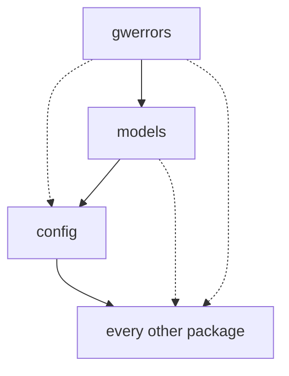
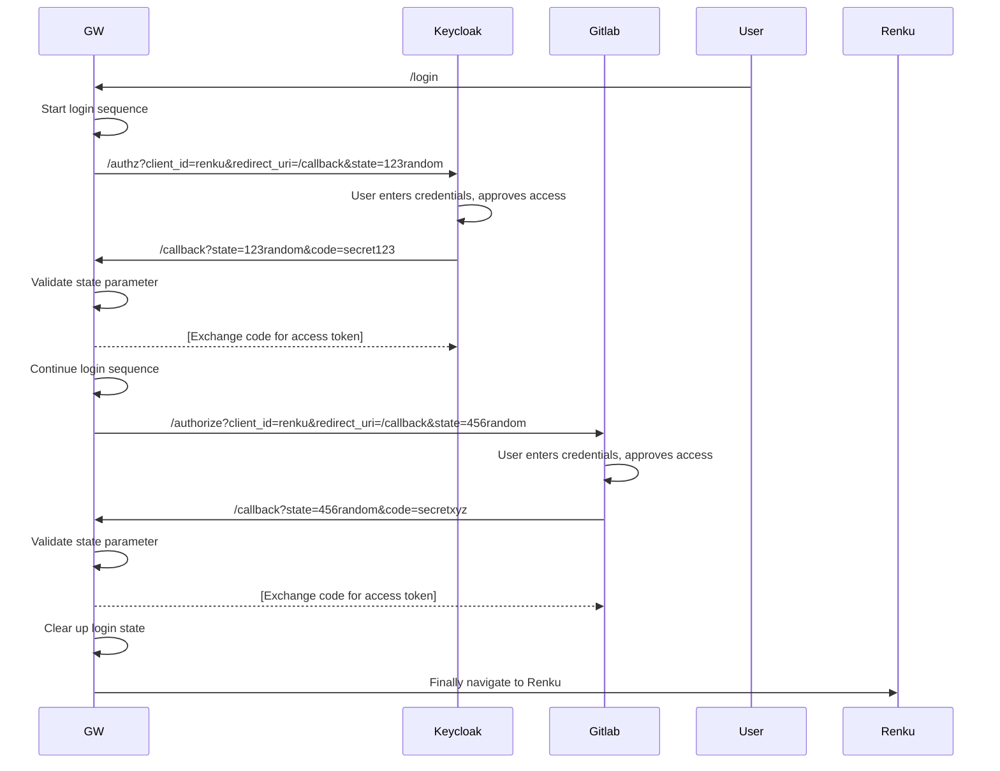

# Renku Gateway

An API Gateway and session service for Renku.

## Package dependencies and import chains

The arrows point in the direction in which a module is imported. So an arrow pointing from 
`models` to `config` means that models can import (depend on) config.

Restrictions:
- `gwerrors` can NOT import from any other package in the gateway
- `models` can only import from `gwerrors`
- `config` can only import from `gwerrors` or `models`
- the rest of the packages can import stuff from anywhere

Circular dependencies are still possible with the above setup but less likely because `config`, `gwerrors`
and `models` are the packages that are most commonly used by other packages. There is no linting
or any other checks or guards in place to enforce this. Hopefully a convention / agreement like this
is enough to avoid problems.

## Login server

The login routes handle authentication for web-based clients.

When a user starts the login flow, a new session is created which will reference authentication tokens once the login flow is done.

## Login flow

## Reverse proxy

The reverse proxy routes incoming requests to the appropriate service and injects the corresponding credentials.
