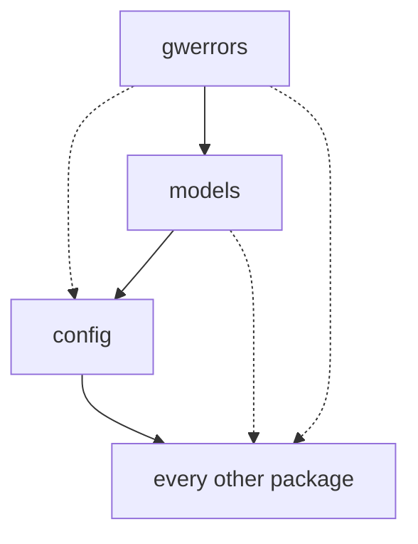
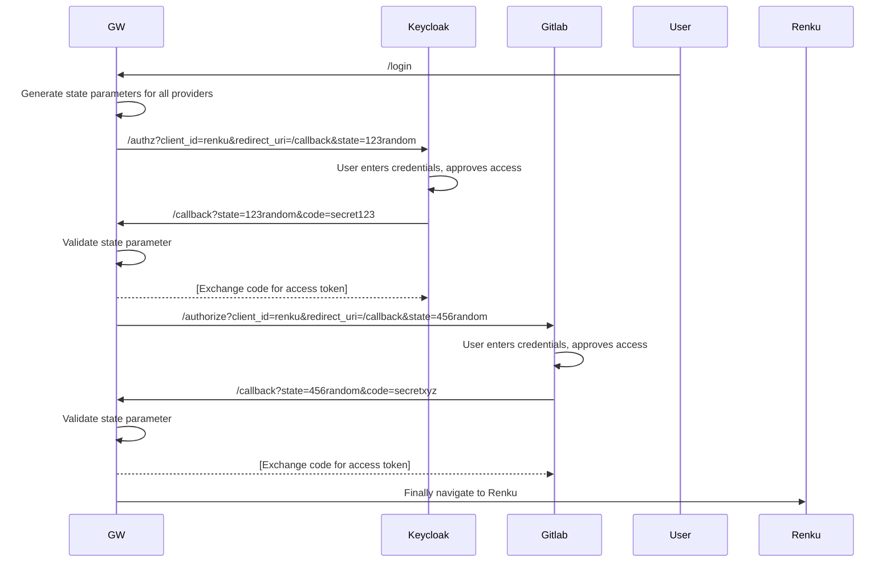
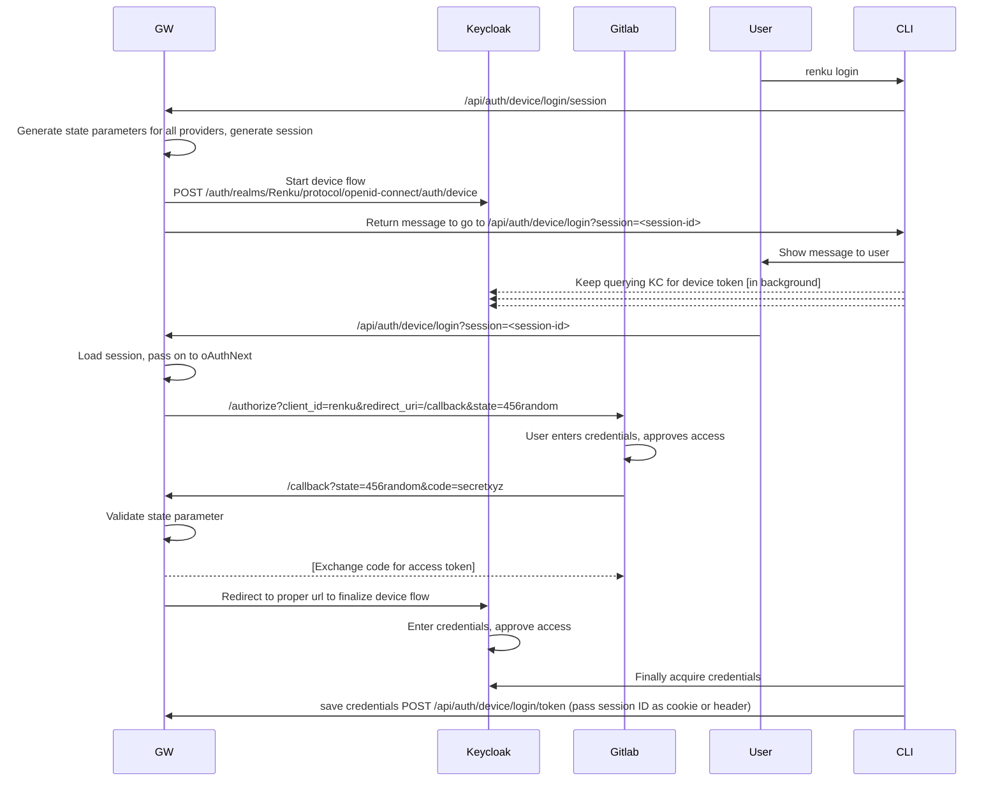

# Renku Gateway

A reverse proxy and Oauth2 flows handler for Renku.

## Package dependencies and import chains

The arrows point in the direction in which a module is imported. So an arrow pointing from 
`models` to `config` means that models can import (depend on) confing.

Restrictions:
- `gwerrors` can NOT import from any other package in the gateway
- `models` can only import from `gwerrors`
- `config` can only import from `gwerrors` or `models`
- the rest of the packages can import stuff from anywhere

Circular dependencies are still possible with the above setup but less likely because `config`, `gwerrors`
and `models` are the packages that are most commonly used by other packages. There is no linting
or any other checks or guards in place to enforce this. Hopefully a convention / agreement like this
is enough to avoid problems.

## Developing

1. Create a client in a Gitlab deployment, for example https://gitlab.dev.renku.ch, with the following configuration:
  - name: renku-gateway
  - callbacks:
    - `http://127.0.0.1:5000/login/redirect/gitlab`
    - `http://127.0.0.1:5000/auth/gitlab/token`
  - scopes: api, read_user, read_repository, read_registry, openid
2. Copy the `.env_template` file inside the `.devcontainer` folder as a file called `.env`
3. Replace the contents of `.devcontainer/.env` with the Gitlab cliend ID and secret from step 1
4. Login as admin to Keycloak at `http://127.0.0.1:5000/auth`
5. Create a real called `Renku` (this is case sensitive in Keycloak and all other applications)
6. Create a client by loading the `.devcontainer/renku.json` file into Keycloak

NOTE: When visiting the address in the browser make sure to use `127.0.0.1` as the host.
The configuration and setup steps here use that as well. Even using localhost instead of `127.0.0.1`
will lead to problems and the login will not complete.

## Oauth2 flows

## Device login flow

