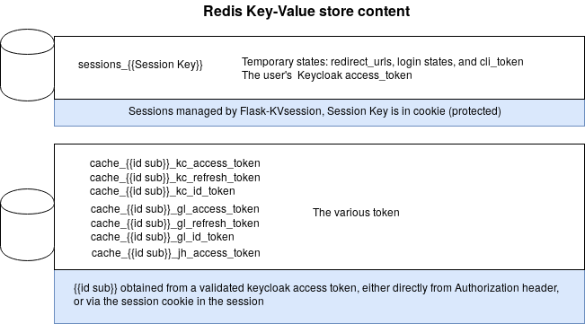

..
  Copyright 2017-2018 - Swiss Data Science Center (SDSC)
  A partnership between École Polytechnique Fédérale de Lausanne (EPFL) and
  Eidgenössische Technische Hochschule Zürich (ETHZ).

  Licensed under the Apache License, Version 2.0 (the "License");
  you may not use this file except in compliance with the License.
  You may obtain a copy of the License at

      http://www.apache.org/licenses/LICENSE-2.0

  Unless required by applicable law or agreed to in writing, software
  distributed under the License is distributed on an "AS IS" BASIS,
  WITHOUT WARRANTIES OR CONDITIONS OF ANY KIND, either express or implied.
  See the License for the specific language governing permissions and
  limitations under the License.

==================
 Renku API gateway
==================

**The Renku platform is under very active development and should be considered highly
volatile.**

The Renku API gateway connects the different Renku clients to the various Renku backend
services (GitLab, Jupyterhub, etc). Currently, it mainly acts on the communication between
the Renku web UI and GitLab.

Quickstart
----------

In order to get an instance of Renku up and running, clone the main Renku
repository and follow these instructions_.

.. _instructions: https://renku.readthedocs.io/en/latest/developer/setup.html

Developing the gateway
----------------------
Once you have an instance of Renku running locally, you could modify the gateway code
and restart the platform through the :code:`make minikube-deploy` command to see the
changes. However, this will make for a very poor development experience as the deployment
process is optimized for production.

Instead we recommend connecting to your minikube (or any other kubernetes cluster) through
telepresence_. Once telepresence is installed, create a python environment and install
the necessary python dependencies by running :code:`pipenv install`. Then, start a
telepresence shell through :code:`make dev` and launch a development server by executing
the prompted command inside the telepresence shell.

.. _telepresence: https://www.telepresence.io/reference/install

The gateway in development setting is now available under the ip-address of your
minikube cluster (:code:`${minikube ip}/api`) and you should see requests from the
Renku UI appear in the logs.

So what is happening here? The command :code:`make dev` launches telepresence which
swaps the renku-gateway service in your minikube deployment for a locally running version of
the gateway served by a flask development server. This gives you live updates on code change
in a minikube deployment!

Tests
-----

You can run tests with

::

    $ pipenv run pytest

Login workflow
--------------

To be able to collect the user's token from the various backend services, the gateway uses the OAuth2/OIDC protocol and redirect the users to each of them.

.. image:: docs/login.png
  :width: 979

Redis storage
-------------

To allow server-side sessions, the gateway relies on Redis.

