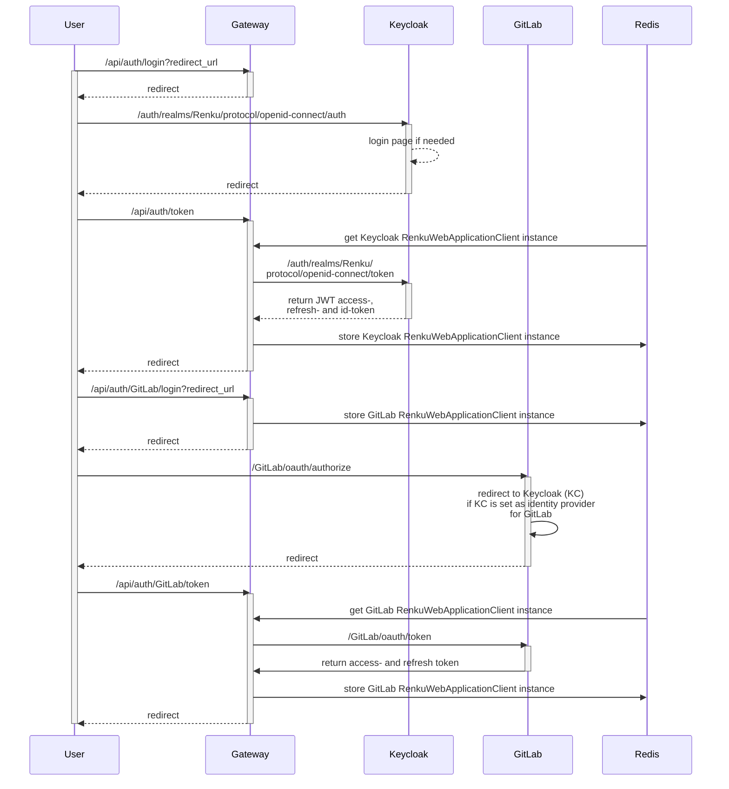

## Login flow

Check out the login flow below in the diagram below. Note the following aspects:

- We use regular client-side sessions to store some short-lived state (temporary id, step
  in the login sequence, URL to redirect to on completion of the login sequence) in a 
  signed cookie.
- OAuth2 authorization codes and the retrieved access-, refresh- and id tokens are stored
  in redis as part of the serialized `RenkuWebApplicationClient`.
- The redis keys are formed from the users keycloak id (ie the `sub` claim). Since this 
  id is not known as we initiate the login process, we generate a random short-lived id
  for a login session which is replaced by the actual keycloak id as soon as this is known.

